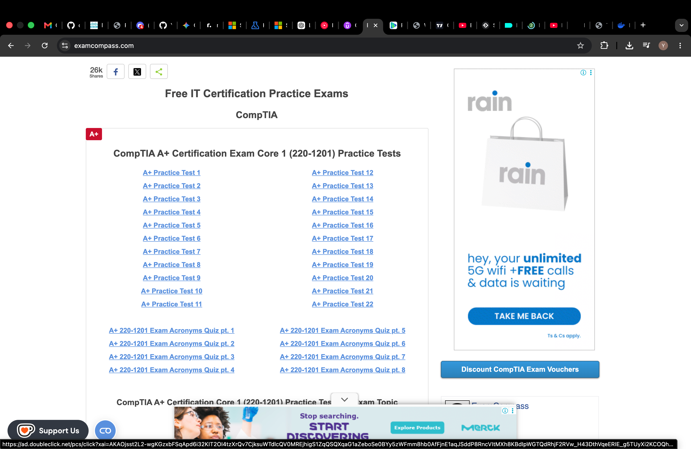
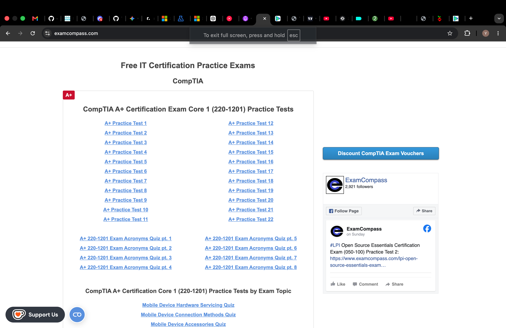
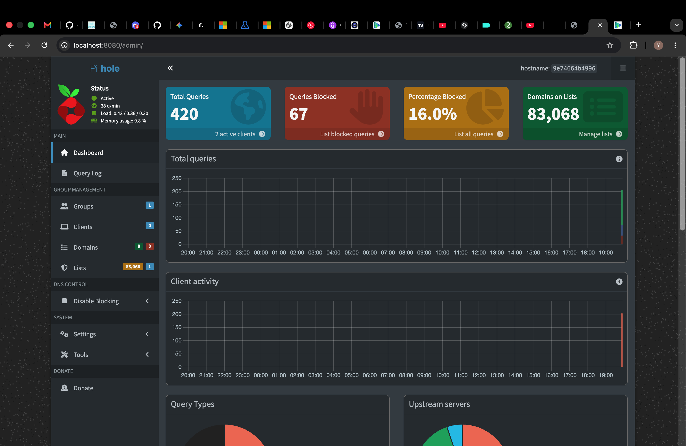
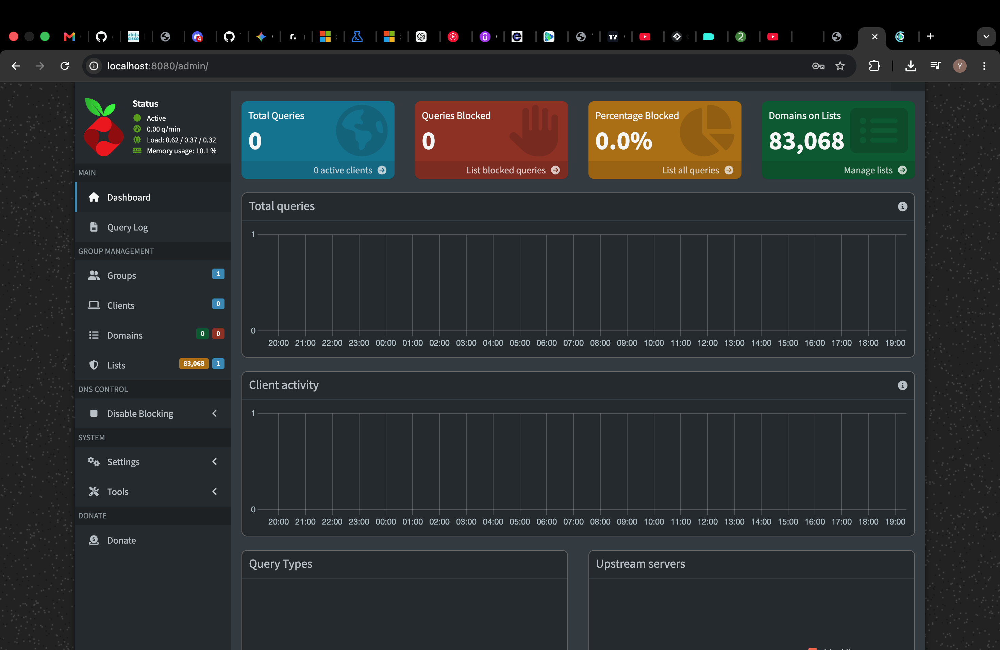
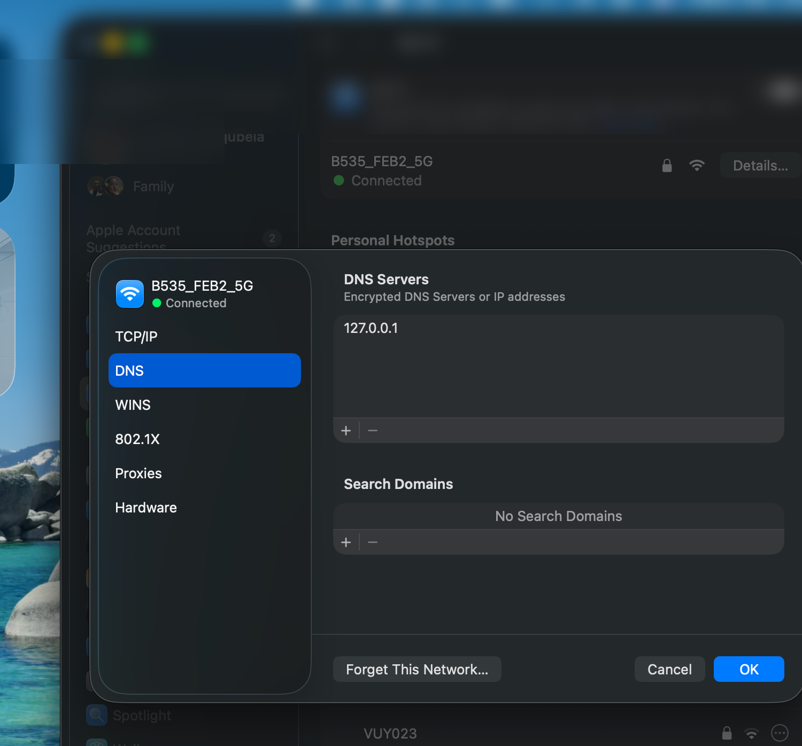
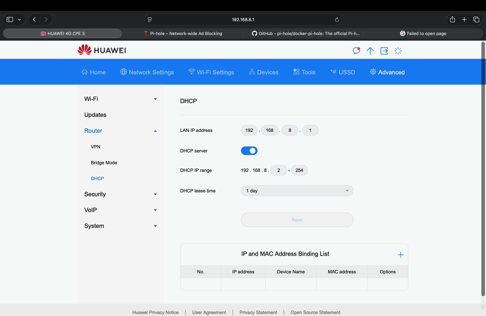

# dns-adblocker

A Pi-hole DNS ad blocker running in Docker on macOS. This project sets up Pi-hole — a network-level ad blocker — as a Docker container on a MacBook, blocking ads and trackers at the DNS level before they even reach your browser.

## Before & After

Without Pi-hole, ads load freely on every website:



With Pi-hole running and DNS pointed to `127.0.0.1`, ads are blocked before they even load:



Pi-hole dashboard showing active blocking — 420 queries processed, 67 blocked (16%):



---

## What is Pi-hole?

Pi-hole is a DNS sinkhole. Instead of letting your browser load ads, Pi-hole intercepts the DNS request for the ad server and blocks it before anything loads. It works across all browsers and apps on any device you point at it.

## What is DNS?

When you type `google.com` into your browser, your computer asks a DNS server "what is the IP address for google.com?" Pi-hole sits between your device and the internet, answering those questions — and blocking the ones that belong to ad networks and trackers.

---

## Prerequisites

**macOS:**
- A MacBook (Apple Silicon or Intel)
- [Docker Desktop for Mac](https://www.docker.com/products/docker-desktop) installed and running

**Windows:**
- Windows 10 (version 2004 or later) or Windows 11
- WSL2 enabled (Windows Subsystem for Linux)
- [Docker Desktop for Windows](https://www.docker.com/products/docker-desktop) installed and running

---

## Project Structure

```
pihole/
├── docker-compose.yml     # Pi-hole container configuration
├── etc-pihole/            # Pi-hole config (auto-created on first run)
└── etc-dnsmasq.d/         # DNS config (auto-created on first run)
```

---

## Setup Instructions

### Step 1 — Install Docker Desktop

Download and install [Docker Desktop for Mac](https://www.docker.com/products/docker-desktop). Choose **Apple Silicon** if you have an M1/M2/M3 chip, or **Intel** if your Mac is older.

Open Docker Desktop and wait for the whale icon in your menu bar to stop animating — that means it's ready.

Verify Docker is working by opening Terminal and running:

```bash
docker --version
```

### Step 2 — Create the project folder

```bash
mkdir ~/pihole
cd ~/pihole
```

### Step 3 — Create the docker-compose.yml file

Create a file called `docker-compose.yml` inside the `~/pihole` folder with the following content:

```yaml
version: "3"
services:
  pihole:
    container_name: pihole
    image: pihole/pihole:latest
    ports:
      - "53:53/tcp"
      - "53:53/udp"
      - "8080:80/tcp"
    environment:
      TZ: 'Africa/Johannesburg'
      WEBPASSWORD: 'your_password_here'
      FTLCONF_dns_listeningMode: 'all'
    volumes:
      - './etc-pihole:/etc/pihole'
      - './etc-dnsmasq.d:/etc/dnsmasq.d'
    restart: unless-stopped
```

> **Important:** Replace `your_password_here` with a password of your choice. This is what you'll use to log into the Pi-hole dashboard.

> **Note on `FTLCONF_dns_listeningMode: 'all'`:** This is required on macOS. Docker on Mac routes traffic through an internal network (`192.168.65.x`), and without this setting Pi-hole rejects those queries with *"ignoring query from non-local network"*. Setting the listening mode to `all` tells Pi-hole to accept queries from any interface.

### Step 4 — Start Pi-hole

```bash
docker compose up -d
```

This downloads the Pi-hole image and starts the container in the background. The first run may take a minute or two.

Verify it's running:

```bash
docker ps
```

You should see `pihole` listed with a status of `Up (healthy)`.

### Step 5 — Access the dashboard

Open your browser and go to:

```
http://localhost:8080/admin
```

Log in with the password you set in `docker-compose.yml`.

When you first log in the dashboard will show 0 queries — this is normal:



### Step 6 — Test DNS is working

In Terminal, run:

```bash
dig @127.0.0.1 google.com
```

If Pi-hole is working correctly, it will return an IP address for `google.com`. If you see *"connection timed out"*, check the [Troubleshooting](#troubleshooting) section below.

### Step 7 — Point your Mac's DNS to Pi-hole

1. Open **System Settings → Network → Wi-Fi → Details → DNS**
2. Click **+** and add `127.0.0.1`
3. Remove any other DNS servers
4. Click **OK** then **Save**

Before — DNS pointing to the router (`192.168.8.1`):


After — DNS pointing to Pi-hole (`127.0.0.1`):



Your Mac will now send all DNS queries through Pi-hole. Browse any website and watch the query count go up in your Pi-hole dashboard. Ads should start disappearing.

---

## Windows Setup

The docker-compose.yml file is the same for Windows. However there are a few Windows-specific steps to follow.

### Step 1 — Enable WSL2

Docker Desktop on Windows requires WSL2. Open PowerShell as Administrator and run:

```powershell
wsl --install
```

Restart your computer when prompted. Then install [Docker Desktop for Windows](https://www.docker.com/products/docker-desktop) and make sure it is set to use the WSL2 backend.

### Step 2 — Fix the Port 53 conflict

Windows has a DNS Client service that occupies port 53 by default, which will block Pi-hole from binding to it. You need to free up that port first.

Open PowerShell as Administrator and run:

```powershell
Set-ItemProperty -Path "HKLM:\SYSTEM\CurrentControlSet\Services\Dnscache" -Name "Start" -Value 4
Stop-Service -Name "Dnscache" -Force
```

This disables the Windows DNS Client service so Pi-hole can take over port 53.

### Step 3 — Run Pi-hole

Follow the same steps as macOS — create the project folder, add the `docker-compose.yml`, and run:

```powershell
docker compose up -d
```

### Step 4 — Point Windows DNS to Pi-hole

1. Open **Control Panel → Network and Internet → Network Connections**
2. Right-click your active network adapter → **Properties**
3. Select **Internet Protocol Version 4 (TCP/IPv4)** → **Properties**
4. Select **Use the following DNS server addresses**
5. Set **Preferred DNS server** to `127.0.0.1`
6. Click **OK**

### Step 5 — Test it

Open Command Prompt and run:

```cmd
nslookup google.com 127.0.0.1
```

If Pi-hole is working, it will return an IP address for `google.com`.

---

## Keeping Pi-hole Running

For Pi-hole to work, you need:

- Docker Desktop open and running (set it to launch on startup in Docker Desktop settings)
- The Pi-hole container running (`restart: unless-stopped` in the compose file handles this automatically)
- Your Mac's DNS still set to `127.0.0.1`

If your internet stops working, go to **System Settings → Network → Wi-Fi → Details → DNS**, remove `127.0.0.1`, and add `8.8.8.8` temporarily while you troubleshoot.

---

## Resetting Your Password

If you need to reset your Pi-hole password:

```bash
docker exec -it pihole bash
pihole setpassword yournewpassword
exit
```

---

## Updating the Blocklist

Pi-hole uses a blocklist called Gravity to know which domains to block. To update it manually:

```bash
docker exec pihole pihole -g
```

---

## Troubleshooting

### "connection timed out" when running `dig @127.0.0.1 google.com`

Check your Docker logs for this warning:

```
WARNING: dnsmasq: ignoring query from non-local network 192.168.65.1
```

If you see this, make sure `FTLCONF_dns_listeningMode: 'all'` is in your `docker-compose.yml` under `environment:`. Then restart the container:

```bash
docker compose down && docker compose up -d
```

### Websites stop loading after changing DNS

Your Mac's DNS is pointing to Pi-hole but Pi-hole isn't responding. Either Docker isn't running or the container stopped. Check with:

```bash
docker ps
```

If the container isn't listed, start it again:

```bash
cd ~/pihole
docker compose up -d
```

### Port 53 conflict (macOS)

On macOS, port 53 is sometimes used by the system. Check what's using it:

```bash
sudo lsof -i :53
```

If something other than Docker is listed, you may need to disable the conflicting service.

### Port 53 conflict (Windows)

On Windows, the DNS Client service occupies port 53 by default. Check what's using it by opening PowerShell as Administrator and running:

```powershell
netstat -ano | findstr :53
```

If something is listed, disable the DNS Client service:

```powershell
Set-ItemProperty -Path "HKLM:\SYSTEM\CurrentControlSet\Services\Dnscache" -Name "Start" -Value 4
Stop-Service -Name "Dnscache" -Force
```

Then restart Pi-hole:

```powershell
docker compose down && docker compose up -d
```

---

## Extending This Setup

This setup only blocks ads on the device where Docker is running. To block ads for your entire home network:

- Set the DNS on your **router** to point to the machine running Pi-hole (requires a static/reserved IP)
- For this to work reliably, Pi-hole should run on an always-on device like a **Raspberry Pi** or a **VPS**, not a laptop

The router admin page (Huawei 4G CPE in this case) is accessible at `192.168.8.1` — DNS settings are typically found under **Advanced → Router → DHCP**:



---

## Resources

- [Pi-hole Official Website](https://pi-hole.net)
- [Pi-hole Docker GitHub](https://github.com/pi-hole/docker-pi-hole)
- [Docker Desktop for Mac](https://www.docker.com/products/docker-desktop)
